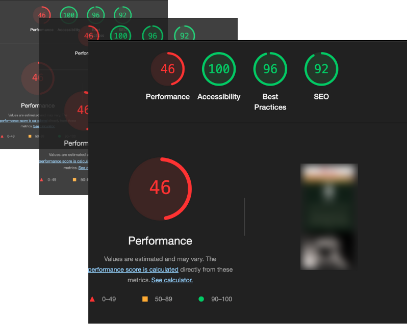

これは[株式会社TimeTree Advent Calendar 2024](https://qiita.com/advent-calendar/2024/timetree)の23日目の記事です。

# はじめに

TimeTree でフロントエンドエンジニアをしています、skitzvilleです！

昨年同様「どうしよう、何書こう今年のアドベントカレンダー、、」と軽くパニックになるフェーズを経て、今回は**Sharpを使ったVite用の画像最適化plugin作成**というトピックについてお話をしようと思います。

# 😨「うわっ、私のサイト、遅すぎ・・・？」

まずは今回のトピックを選ぶに至った経緯から。（前日談的な部分なので「どうやって作るのかだけ教えてよ！」という方は読み飛ばしちゃってください笑）

先日友人から依頼を受け、Vite + React という構成のシンプルな Web サイトを作成する機会がありました。
完成後のサイトを実機で表示してみたところ、「あれ、思ったよりも表示に時間がかかるな、、🤔」と感じ、試しにLighthouseで計測をしてみたところ、、



**「うわっ、私のサイト、遅すぎ・・・？」**

さらにこの計測結果をよくみてみると、どうやら画像の表示にかなりの時間がかかってる事が表示を遅くする原因のようでした。
ただ作成したサイトでは一般的に行われる画像最適化の対策のうちいくつか（Lazy Load、画像ファイル自体の圧縮 etc...）はすでに実施済みだったため、「どうしようかな〜」と調べていたところ WebP・AVIF といった新しい形式の画像を使用すると良さそうという事がわかりました。

## WebP・AVIF って？？

WebP・AVIFはいずれも画像形式の種類で、メジャーなPNGやJPEGよりもより新しい画像形式です。
めちゃくちゃざっくりですが以下それぞれの特徴をまとめてみました。

|        | WebP                                                                                                                                                                  | AVIF                                                                      |
| ------ | --------------------------------------------------------------------------------------------------------------------------------------------------------------------- | ------------------------------------------------------------------------- |
| 読み方 | 公式な発表はないものの weppy（ウェッピー）と発音するらしい                                                                                                            | AV1 Image File Format の略、エーブイアイエフと読む                        |
| 特徴   | - 透過・アニメ・圧縮に対応<br>- 他の画像フォーマットと比較しても軽量で高画質(JPEG と比較すると 20〜30%ほど軽量)<br>- 画像劣化のないロスレス形式と高圧縮の選択もできる | - 透過・アニメ・圧縮に対応<br>- WebP と比較してもさらに高画質でコンパクト |

またWebP・AVIFはいずれも従来の画像フォーマットよりも比較的新しいフォーマットですが、主要ブラウザ（Chrome, Safari etc...）ではすでにサポートされています。
データサイズを大幅に削減できるなどメリットも大きそうなことから「これは利用するしかない！」ということで、サイト上で使用する画像をこれらのフォーマットに変換することを決めました。

# 📸 Viteのpluginで画像をWebpに変換！
WebP・AVIFという最新の軽量な画像フォーマットを使用することは決まったものの、「手作業でJPEGやPNG画像をWebPに変換するのは面倒くさいなぁ、、」という思いが残ります。将来的に使用する画像が差し替えになる可能性も考えると、画像の変換作業は自動化したいですよね。
そこで今回は、Sharpという画像処理のライブラリを使用しビルド時に画像をWebPに変換するViteのpluginを作成してみることにしました。

## Vite pluginについて
ViteのpluginはRollupのインターフェースをベースとしているため、開発にあたってはViteの公式ドキュメントに合わせてRollup側のドキュメントも参照されることをお勧めします。
https://vite.dev/guide/using-plugins
https://rollupjs.org/plugin-development

## Sharpとは？？
https://sharp.pixelplumbing.com/
SharpはNode.js向けの画像処理ライブラリで、JPEG、PNG、WebP、GIF、SVGなど、さまざまな画像フォーマットをサポートしています。
Sharpを使うことで、画像のリサイズ・トリミング・変換・圧縮などさまざまな画像処理を行うことができるようになります。

## plugin用の雛形コードの作成
Viteでpluginを作成する際には以下のポイントがあります。

- pluginの処理自体は関数として作成する
- `defineConfig`の`plugins`に追加することで利用が可能
- `load`, `transform`などビルドプロセスの各ステージ毎にhooksが用意されているので、実行したい処理を適切なhooksの中に実装する

上記の内容を踏まえ、まずはVite plugin用の雛形コードを作成していきます。
ポイントでも述べた通り、pluginで行う処理の実体を`convertImagesToWebp`という関数で作成し、その関数を`defineConfig`の`plugins`に渡すことでpluginを実行しています。
```typescript:plugins/vite-plugin-convert-webp.ts
import type { Plugin } from "vite";

export const convertImagesToWebp: Plugin = {
  name: "vite-plugin-convert-webp",
  buildStart: async () => {},
  transform: async (code, id) => {},
};
```

```typescript:vite.config.ts
import { defineConfig } from "vite";
import { convertImagesToWebp } from "./plugins/vite-plugin-convert-webp";

export default defineConfig({
  plugins: [
    react(),
    convertImagesToWebp,
  ],
});
```

## pluginの実装
作成するpluginは大まかに以下のような方向性で実装することにしました。

1. srcディレクトリ内にあるJPEG・PNGファイルをWebP画像に変換する
2. コードベース内でJPEG・PNGファイルを参照している箇所を、WebPを参照するようにコードの置換をする

### 1. JPEG・PNGファイルをWebP画像に変換
Sharpで画像変換を行うには変換対象となる画像のファイル名を含んだパスを指定する必要があるため、まずは画像ファイルのパスをリストアップする処理を実装します。
以下の`getImagePaths`では、srcディレクトリ内にある画像ファイルを再帰的に洗い出す処理を行っています。

```typescript:plugins/vite-plugin-convert-webp.ts
import fs from "fs/promises";
import path from "path";

const IMAGE_PATH = "../src/images";

const getImagePaths = async (dir?: string) => {
  try {
    const dirContents = await fs.readdir(
      path.resolve(__dirname, dir ? `${IMAGE_PATH}/${dir}` : IMAGE_PATH)
    );

    let mutableFiles: string[] = [];

    for (const content of dirContents) {
      if (
        !content.endsWith(".png") &&
        !content.endsWith(".jpg") &&
        !content.startsWith(".")
      ) {
        mutableFiles = [
          ...mutableFiles,
          ...((await getImagePaths(content)) ?? []),
        ];
        continue;
      }
      
      if (!content.startsWith(".")) {
        mutableFiles.push(
          dir
            ? `${path.resolve(__dirname, IMAGE_PATH)}/${dir}/${content}`
            : `${path.resolve(__dirname, IMAGE_PATH)}/${content}`
        );
        continue;
      }
    }

    return mutableFiles;
  } catch (error) {
    console.log("Error happened here!!:", error);
  }
};
```

次にリストアップしたJPEG・PNGファイルを元にWebP画像を生成する処理を実装します。

```typescript:plugins/vite-plugin-convert-webp.ts
const convertImages = async (imagePaths: readonly string[]) => {
  for (const imagePath of imagePaths) {
    const dir = path.dirname(imagePath);
    const fileName = path.basename(imagePath, path.extname(imagePath));
    const webpPath = path.resolve(dir, `${fileName}.webp`);

    try {
      // Sharpを使った画像の生成処理
      await sharp(imagePath).webp().toFile(webpPath);
    } catch (error) {
      console.log(error);
    }
  }
};
```

ここで初めてSharpが登場します！
APIの詳細については公式のドキュメントを参照いただくのが一番ですが、ざっくりとした説明をすると

1. `sharp(imagePath)`で変換元の画像ファイルパスを指定
2. `.webp()`でWebP形式に変換
3. `.toFile(webpPath)`で変換後のファイルパスを指定

という一連の流れをチェーンメソッドで実行していきます。

そしてここまで実装ができたら、これらの処理を`buildStart`hook内で実行します。

```typescript:plugins/vite-plugin-convert-webp.ts
import type { Plugin } from "vite";

const convertImagesToWebp: Plugin = {
  name: "vite-plugin-convert-webp",
  buildStart: async () => {
    const imagePaths = (await getImagePaths()) ?? [];
    await convertImages(imagePaths);
  },
  transform: async (code, id) => {},
};
```
ここでコードベース内のJPEG・PNGファイルをWebP画像に変換する処理については一旦完了となります。

### 2. コードの置換
次にコードベース内でJPEG・PNGファイルを参照している箇所を、WebPを参照するようにコードの置換を行います。
こちらについては`transform`hook内で実装します。

```typescript:plugins/vite-plugin-convert-webp.ts
const convertImagesToWebp: Plugin = {
  name: "vite-plugin-convert-webp",
  buildStart: async () => {
    const imagePaths = (await getImagePaths()) ?? [];
    await convertImages(imagePaths);
  },
  // コードの置換処理
  transform: async (code, id) => {
    if (id.endsWith(".ts") || id.endsWith(".tsx")) {
      const updatedCode = code.replace(/(\.png|\.jpe?g)(?=";)/g, ".webp");
      return {
        code: updatedCode,
        map: null,
      };
    }

    return null;
  },
};
```

`transform`hook内が受け取る引数の`code`・`id`ですが、それぞれ実体は以下のようになっています。

- `code`: ファイルの中身（コード）
- `id`: ファイルのパス

より詳細な説明についてはRollupの公式ドキュメントにも記載がありますので気になる方はそちらも参照してみてください。
https://rollupjs.org/plugin-development/#transform

## 🚨注意ポイント
以下開発中にハマったポイントです！

**1. pluginはデフォルトだと開発サーバーを立ち上げただけでも実行されてしまう**
「ビルド時だけpluginを実行したい」など、適用する環境を指定したい場合は`apply: build`といった記述をpluginファイルに加えることでコントロールができます
```typescript:plugins/vite-plugin-convert-webp.ts
const convertImagesToWebp: Plugin = {
  name: "vite-plugin-convert-webp",
  // この記述を追加するとビルド時のみpluginが実行される
  apply: build,
  buildStart: async () => {
    const imagePaths = (await getImagePaths()) ?? [];
    await convertImages(imagePaths);
  },
  transform: async (code, id) => {
    if (id.endsWith(".ts") || id.endsWith(".tsx")) {
      const updatedCode = code.replace(/(\.png|\.jpe?g)(?=";)/g, ".webp");
      return {
        code: updatedCode,
        map: null,
      };
    }

    return null;
  },
};
```

**2. 画像生成の処理については`transform`hook以前の段階で実行しておかないとViteに認識してもらえない**
当初は「`transform`hook内で画像の生成＆参照先の置き換え両方やっちゃえばいいじゃん！」と思っていたのですが、実際に両方を`transform`hook内で実行すると、生成したWebP画像が見つからないとエラーになってしまいました。そのため、画像生成の処理は`buildStart`hook内で実行するようにしています。

# Plugin導入の結果
作成したpluginの導入後、再度Lighthouseで計測を行ってみたところ各種数値に大幅な改善が見られました！！🎉🎉

- Lighthouseのパフォーマンススコアが**49 → 88**に改善！！
- Speed indexもプラグイン導入前後で速度が**6.9s → 3.4s**に変化！！

またサイト上で使用している画像のファイルサイズもプラグイン導入後は、大きなもので約50%ほどファイルサイズを縮小することができました！

# まとめ
以上簡単ですがViteのplugin作成＆Sharpを使った画像最適化処理を行う方法についてのご紹介でした！
~~この手のplugin、探せば絶対にどこかに転がってるはず＆自分でわざわざ作る必要もないかもですが~~　自分自身Viteのplugin開発についての知識がゼロだったので、今回の実装を通してplugin開発の大まかな流れをつかむことができました。
同じようにViteでのplugin開発が気になっている方はぜひ一度チャレンジしてみてはいかがでしょうか！