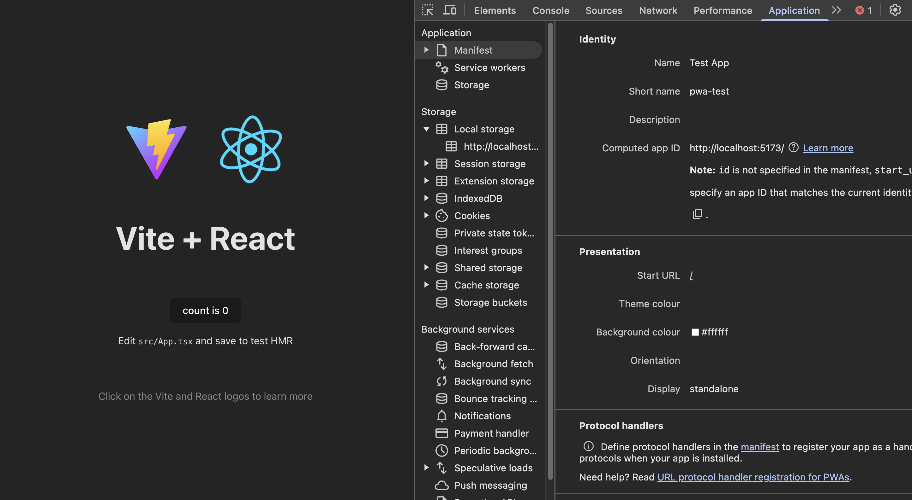

# これは何

## そもそも PWA って

ご存知の方も多いかもしれませんが、そもそも PWA って何なのという部分にさらっと触れておきます！

- PWAはProgressive Web Application の略称
- Webサイト・アプリケーションをネイティブアプリのように使えるようにする仕組み
- Service Worker、Web App Manifest といった技術を利用して、次のような機能がWebサイト・アプリケーションでも使えるようになります
  - ✅ アプリのインストール（アプリのようにホーム画面に追加できる）
  - ✅ オフライン対応 （ネットがなくてもoffline cacheを利用して動作させることができる）
  - ✅ ネイティブアプリに近いUIの提供
  - ✅ プッシュ通知対応

## PWA化のための技術的要件

そんないいことづくめのPWAですが、ブラウザからWebアプリをPWAとしてインストールするためにはいくつかの技術的な要件を満たしてる必要があります。

### Web App Manifest

JSON形式のmanifestファイルで、インストールされたアプリがデバイスの中でのどのような見た目になるか、挙動をするかといった情報をブラウザに伝える役割を担っています。

[設定可能なプロパティ](https://developer.mozilla.org/en-US/docs/Web/Manifest)は色々ありますが、ChromiumをベースにしたブラウザではPWA化のために以下の項目の設定が必須となっています。

- `name`: インストールしたデバイス上で表示するアプリの名前
- `icons`: インストールしたデバイス上で表示するアプリアイコン。192x192, 512x512はマストで用意する必要があります
- `start_url`: インストールしたアプリをユーザーが起動した際に表示するページURL
- `display`: インストールしたアプリがどのような見た目になるかの設定。`standalone`が一番一般的なネイティブアプリに近い見た目の表示になり、ブラウザ固有のナビゲーションバーとかが消える。`minimal-ui`はナビゲーションバーなどに必要最低限の要素を配置するレイアウト
- `prefer_related_applications`: PWAではないネイティブのアプリが存在し、そちらのダウンロードを推奨するかどうか

### HTTPS/localhost

PWAを有効にするには、ページがHTTPS、もしくはlocalhostで提供される必要があります。
これはMan in the Middle Attack（中間者攻撃）を回避するためのセキュリティ的な懸念からこのような仕様となっているようです。

### Service Worker

⚠️PWAではoffline cacheなどの利用を可能にするService Workerを使用するケースが多いですが、Service Workerを利用すること自体はPWAとしてWebアプリをインストールできるようにする技術要件には含まれていません。

## ViteアプリをPWA化する方法

それでは今回の本題でもある、ViteアプリをPWA化する方法について見ていこうと思います！

Viteアプリの場合はPWA化のためのvite-plugin-pwaというプラグインが存在し、そちらを利用することで簡単にPWA化を行うことができます。

https://vite-pwa-org.netlify.app/

以下がざっくりとした手順になります。

1. vite-plugin-pwaをインストール
2. vite.config.tsに記述を追加
3. ビルドを実行🚀

### vite.config.tsに記述を追加

vite-plugin-pwaのインストールができたら、実際にvite.config.tsに記述を追加していきましょう。

```typescript
import { defineConfig } from "vite";
import { VitePWA } from "vite-plugin-pwa";

export default defineConfig({
  plugins: [
    VitePWA(),
  ],
});
```

- vite-plugin-pwaから提供されている`VitePWA`というモジュールを`plugins`の中に追加します
- 実はこの記述だけでもmanifestの生成やService Workerの読み込みなどを行ってくれるのですが、このままだとmanifestの内容はプラグインが用意するデフォルト情報になってしまうため、カスタマイズしたい場合はオプションを指定する必要があります

```typescript
import { defineConfig } from "vite";
import { VitePWA } from "vite-plugin-pwa";

export default defineConfig({
  plugins: [
    VitePWA({
      devOptions: { enabled: true },
      manifest: {
        name: "Test App",
        icons: [
          {
            sizes: "192x192",
            src: "icon-192x192.png",
            type: "image/png",
          },
          {
            sizes: "512x512",
            src: "icon-512x512.png",
            type: "image/png",
          },
          {
            sizes: "512x512",
            src: "icon-512x512.png",
            type: "image/png",
            purpose: "maskable",
          },
        ],
      },
    }),
  ],
});

```
- 追加でカスタマイズしたい場合は上記のように`VitePWA`の引数にオプションを指定してあげることで設定を変更することができます
- `VitePWA`に渡している引数の中に`devOptions`というプロパティがありますが、こちらを`{enabled: true}`でセットしてあげることで開発環境でも確認ができるようになります。
- Viteアプリの場合ここで指定するアイコンは`public`ディレクトリに配置しておけば上記のようにsrcにファイル名を記述するだけでアイコンを指定することができます
- 複数指定しているアイコンの一番最後にpurpose: "maskable"というプロパティを追加していますが、これはマスク可能なアイコンとして指定するための記述です。[マスク可能なアイコン](https://developer.mozilla.org/ja/docs/Web/Manifest#maskable_icon)とは何かについてはMDNの説明が参考になりますので、興味がある方はぜひご参照ください

以上vite.config.tsに記述を追加する際のポイントでした！
あとはこの状態でアプリをビルドすると、PWA化されたアプリが生成されるようになります。



アプリを立ち上げ開発者ツールのApplicationタブを開くとManifestという項目があり、そこから設定した内容が反映されていることが確認できます。

## 終わりに

駆け足でしたが以上ViteアプリをPWA化する方法についての解説でした！
実際個人開発しているWebアプリをこの方法でPWA化してみましたが、やはりネイティブアプリのようなUIでの動作やホーム画面からアプリを起動して使えるようになるとテンションが上がりますね笑
